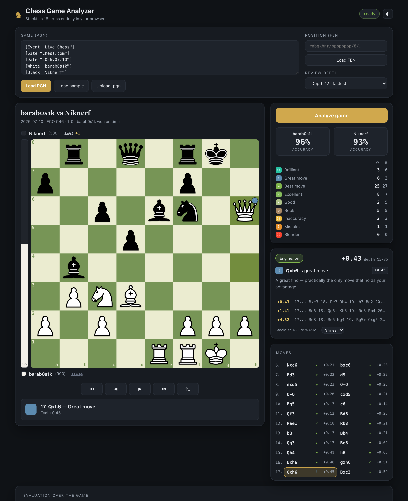

# Chess Analyzer

A game-review tool that runs **Stockfish 18** entirely in your browser (WebAssembly).
Type your Chess.com or Lichess username — or paste any PGN or FEN — and get a full analysis:
move classifications, per-side accuracy, an eval bar, captured-material tracking, and live
engine lines. **Your games are never uploaded** — the engine runs on your own machine.

**► Live app: https://barabosik.github.io/chess-analyzer/**



## Features

- **Import your games** — type your **Chess.com** or **Lichess** username and your last 30 games
  appear: win/loss/draw, both ratings, the opening, time control and date. Click one and it loads,
  already flipped to the side you played. No login, no API key, no copy-pasting PGNs.
- **Or paste a game link** — drop in any `lichess.org/…` URL, or a `chess.com/…` game or analysis
  URL, and that exact game opens, oriented to the player the link is about. (Chess.com only serves
  games *by player*, so for their links either use the `?username=…` one their Share button gives
  you, or just search your username once first — after that any link to one of your own games works.)
- **Full game review** — every position is analyzed and each move is labelled
  Brilliant · Great · Best · Good · Book · Inaccuracy · Mistake · Blunder,
  the way an online game review does.
- **Accuracy score** for both sides, plus a breakdown of how many of each move type each player made.
- **Live engine** — the current position is analyzed continuously with multiple principal
  variations shown in real notation, and a clear *"X is best"* suggestion.
- **Eval bar + captured material** — see who's winning and the exact material difference at a glance.
- **Import anything** — paste a PGN (Chess.com / Lichess exports work as-is), upload a `.pgn`
  file, or load a single position from a FEN.
- **Opening names** — the game's opening is identified from a real openings book
  ("Four Knights Game: Scotch Variation, Main Line · C47"). Book moves are labelled
  from actual theory, and never get a "better move" suggestion — they're theory, there is no better.
- **Explore lines** — **drag a piece** (or click it, then click a square) to play out your own
  variations from any position; the engine follows along. Legal squares light up as you pick a
  piece up, an illegal drop returns it, and it works with touch as well as a mouse.
  Hit *Return to game* to jump back.
- **Move sounds** — synthesized in the browser (distinct move / capture / check / castle), with a mute toggle.
- **Time spent per move** — Chess.com and Lichess stamp every move with the mover's remaining clock,
  so the app shows how long each move took, drawn as a bar per move coloured by how good the move was.
  A blunder played in two seconds is impossible to miss. After a review it states the verdict plainly:
  *"barab0s1k spent a median 13s on the 3 moves that went wrong, versus 5.6s on the rest."*
- **Shareable links** — copy a link that reopens the exact game or position for anyone you send it to.
  For a game imported from Chess.com or Lichess the link is a ~50-character pointer to the game itself;
  for a pasted PGN it is gzip-compressed (a 4,656-character link becomes 1,718).
- **Private analysis** — the engine is bundled and executes locally via WebAssembly, so no game is
  ever sent anywhere to be analyzed. The *only* network request the app makes is the optional
  username lookup against Chess.com's and Lichess's public game APIs — and it goes straight from
  your browser to them, with no server of ours in between.
  Keyboard navigation (`←` `→` `Home` `End`, `f` to flip), light/dark theme.

## How it works

1. `chess.js` parses the PGN/FEN and generates legal moves and SAN.
2. A single-threaded Stockfish 18 build (compiled to WebAssembly) runs in a Web Worker,
   driven over the UCI protocol.
3. For a review, each position is searched to the chosen depth with 2 principal variations.
   Each move's win-probability loss versus the engine's best line decides its label; sacrifices
   that stay winning are flagged **Brilliant** and critical only-moves **Great**.
   Accuracy is estimated from the average win-probability loss.

4. Username import calls the sites' public, key-less endpoints straight from the browser —
   `api.chess.com/pub/player/{user}/games/{yyyy}/{mm}` (walking back through the monthly archives)
   and `lichess.org/api/games/user/{user}`. Both send `Access-Control-Allow-Origin: *`, so this
   needs no proxy and no server.
5. Opening a game *by link* is easy on Lichess (`lichess.org/game/export/{id}` returns the PGN).
   Chess.com has no public single-game endpoint, and its internal one sends no CORS header, so a
   static page cannot fetch a game from its id alone — it can only be found by scanning a *player's*
   monthly archives. The player comes from the link's `?username=`, or failing that from the last
   username you searched (which is what makes `/analysis/` links work for your own games). Chess.com
   game ids are *not* ordered by date — id ranges overlap month to month for active players — so the
   archives can't be bisected; it's an honest scan back through up to 24 months.

6. Clock times come from the `{[%clk 0:09:58.5]}` comments both sites write into their PGNs.
   chess.js discards comments, so they're read from the PGN text and paired with the moves; time
   spent on a move is what that player's clock lost since their previous turn, plus the increment.

Because it's single-threaded WASM, it needs no special server headers and works on plain
static hosting like GitHub Pages.

## Share link formats

| Hash | Used for | Size |
|------|----------|------|
| `#g=cc:<id>:<user>` / `#g=li:<id>` | a game imported from Chess.com / Lichess — re-fetched on open | ~50 chars |
| `#z=<gzipped pgn>` | a pasted PGN, with no game to point at | ~1/3 of raw |
| `#pgn=` / `#fen=` | older links | still read, never generated |

## Run locally

No build step — it's static files. Serve the folder over HTTP (ES modules and the WASM
worker won't load from `file://`):

```bash
git clone https://github.com/Barabosik/chess-analyzer.git
cd chess-analyzer
python3 -m http.server 8000
# open http://localhost:8000
```

## Project layout

```
index.html            markup + layout
css/style.css         theme tokens, board, panels (light & dark)
js/engine.js          UCI wrapper around the Stockfish Web Worker
js/review.js          full-game review + move classification + accuracy
js/board.js           FEN -> board rendering, highlights, click-to-move
js/onlinegames.js     Chess.com / Lichess game-list fetching
js/app.js             UI state, PGN/FEN import, navigation, live analysis
vendor/chess.js       chess.js (move generation, PGN/FEN)
vendor/stockfish/     Stockfish 18 lite, single-threaded WASM
```

## Adjusting engine strength

Review depth is selectable in the UI (10–18). Higher depth = more accurate labels but slower.
The bundled build is the *lite* net (~7 MB) for fast loading; it is already far stronger than
any human and more than enough for accurate game review.

## Contributing

Pull requests are welcome — bug fixes, new features, or polish. There's no build step,
just serve the folder and edit. See **[CONTRIBUTING.md](CONTRIBUTING.md)** for setup, a
manual test checklist, and the PR process. Please keep it framework-free and use only
freely licensed assets.

## Credits & license

- Analysis engine: [Stockfish](https://github.com/official-stockfish/Stockfish),
  compiled to WebAssembly via [nmrugg/stockfish.js](https://github.com/nmrugg/stockfish.js).
- Move generation / PGN: [chess.js](https://github.com/jhlywa/chess.js).
- Board pieces: the **cburnett** SVG set by Colin M. L. Burnett (GPL), via [lichess-org/lila](https://github.com/lichess-org/lila).
- Opening book: [lichess-org/chess-openings](https://github.com/lichess-org/chess-openings) (CC0 / public domain).

Stockfish is licensed under the **GNU General Public License v3**. Because this project
bundles it, the project is distributed under the **GPLv3** as well — see [LICENSE](LICENSE).

## Workspace, AI Coach and Training

The app is a single analysis workspace: **board | move list + engine | AI Coach & Training**, with the
evaluation graph, breakdown and per-phase accuracy in a row underneath. The board is sized from the space
that is actually available, so it re-fits when you resize the window or change the browser's zoom level.

- **AI Coach** summarises the game, lists the critical mistakes (click one to jump to it), and explains the
  concepts and recommendations behind them. It is data-driven: everything comes from the review.
- **Training** turns those mistakes into positions to practise. *Try it* opens a dedicated mode: find the best
  move, and if you miss it you get *why*, the *consequence* (checked by the engine), and a visual explanation
  on the board — fork / pin / skewer / double attack / discovered attack are drawn from the real position.
- The Coach and Training are on by default. Add `?coach=off` to the URL for the earlier review-only view.
- `node tests/run.mjs` runs the browser suites; `node tests/run.mjs workspace training tactics` runs just these.
  The `import`, `links` and `share-and-clocks` suites need network access to Chess.com / Lichess.
